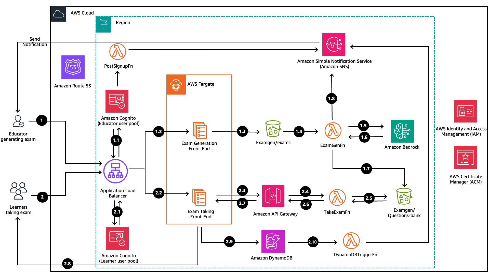
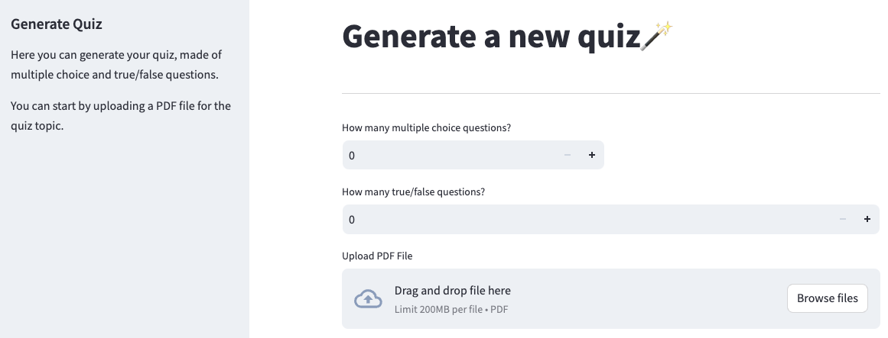
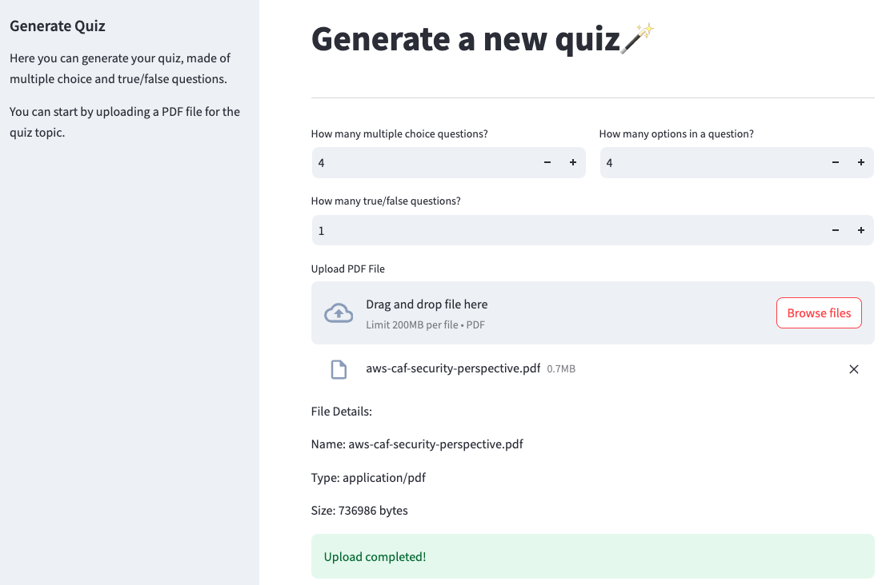
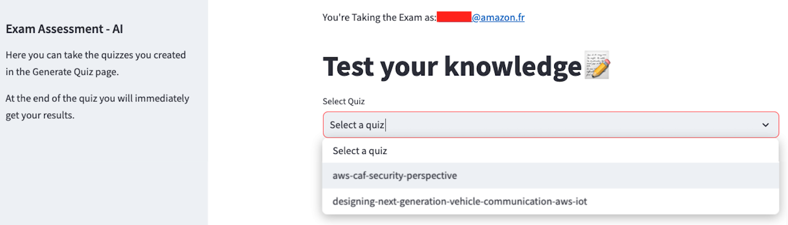
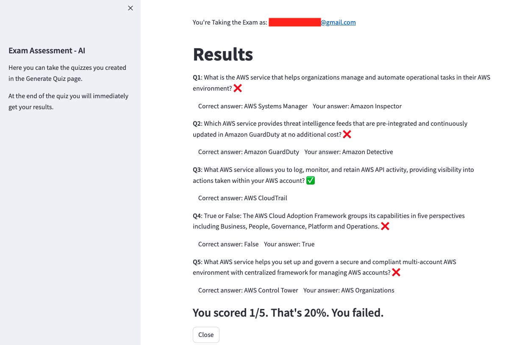

# exam-generator


## Description

This code sample will help you build **a serverless Exam Generator application from your own lecture content using  Amazon Bedrock**.

Crafting new questions for exams and quizzes can be tedious and time-consuming for educators. We would like to leverage Generative AI capabilities on AWS and the AWS Serverless Application Model (AWS SAM) to simplifiy the exam creation process in order to increase educators’ productivity and foster student success.  

## Architecture diagram
The following diagram illustrates the application architecture. We distinguish two paths: Educator path (1) and Learner path (2).

Both Educator and learner need to previously complete the sign-up process.




1.	Educator goes to the landing page for generating exam under your domain exam-gen.your-domain-name through Amazon Route 53 which redirects the request to the Application Load Balancer

    1.1.  Application Load Balancer communicates with Amazon Cognito to authenticate the Educator

    1.2.  Educator uploads a lecture pdf file into the Exam Generation Front-End

    1.3.  The Amazon ECS container running on AWS Fargate uploads the file to Amazon S3 at Examgen bucket under prefix exams

    1.4.  The S3 bucket is configured using event notification. Whenever a new file is uploaded, a PUT Object is activated to send the file the ExamGenFn Lambda function
    
    1.5.  The Lambda function ExamGenFn invokes Amazon Bedrock (Claude v2 model) to generate exam questions and answers as a json file 
    
    1.6.  Amazon Bedrock returns the output Q&A json file to the Lambda function
    
    1.7.  The ExamGenFn Lambda function saves the output file to the same S3 bucket under the prefix Questions-bank. (You can choose to save it to a different S3 bucket)
    
    1.8 The ExamGenFn Lambda function sends an email notification to the educator through Amazon SNS to inform that the exam has been generated

2.	Learner goes to the landing page for taking exam under your domain take-exam.your-domain-name through Amazon Route 53 which redirects the request to the Application Load Balancer
    
    2.1. Application Load Balancer communicates with Amazon Cognito to authenticate the Learner on the Learner user pool
    
    2.2. Learner accesses the frontend and selects a test to take

    2.3. The container image sends the REST API request to Amazon API Gateway (GET Method)

    2.4. API Gateway communicates with the TakeExamFn Lambda function as a proxy (API Gateway Lambda proxy integration)

    2.5. Lambda TakeExamFn function retrieves from S3 bucket under the prefix Questions-bank the available exam in json format

    2.6.  The json file is returned to API Gateway 

    2.7.  API Gateway transmits the json to the ECS container in the frontend

    2.8.  The container presents the exam as UI using streamlit framework. Learner takes the exams. Once finished and clicks submit, ECS container performs the comparison between the answers provided and the correct answers, then shows the score results to the Learner

    2.9. ECS container stores the scorecard in a Amazon DynamoDB table
    
    2.10. Lambda DynamoDBTriggerFn detects the new scorecard record on the DynamoDB table and sends an email notification to the Educator with the Learner’s scorecard.


    


## Prerequisites

- You will need to install the following
    - Request [model access](https://docs.aws.amazon.com/bedrock/latest/userguide/model-access.html) for Anthropic Claude v2 model.
    - [AWS CLI](https://docs.aws.amazon.com/cli/latest/userguide/getting-started-install.html), which is the AWS Command Line Interface (AWS CLI), an open-source tool that enables you to interact with AWS services using commands in your command-line shell
    - [SAM CLI](https://docs.aws.amazon.com/serverless-application-model/latest/developerguide/install-sam-cli.html) is your toolkit for building and running your serverless application on AWS
    - [Streamlit](https://docs.streamlit.io/get-started/installation), an open-source Python framework we use for building the front-end
    - [Docker engine](https://docs.docker.com/engine/install/)
    -[Python](https://www.python.org/downloads/)
    - [Git](https://github.com/git-guides/install-git)

- If you do not already have a DNS domain registered, you will need to create one in order not to expose the DNS of your ALB. You can register a domain on Amazon Route 53 by following [these step](https://docs.aws.amazon.com/Route53/latest/DeveloperGuide/domain-register.html).

- You will also need to request two public certificates, one for each front-end: exam-gen.your-domain-name and take-exam.your-domain-name. Follow [this procedure](https://docs.aws.amazon.com/acm/latest/userguide/gs-acm-request-public.html) to request a public ACM certificate on AWS Certificate Manager.

Save genCertificateArn and takeCertificateArn to your notepad.


## Installation

Configure AWS CLI

We recommend [using temporary credentials with the AWS CLI](https://docs.aws.amazon.com/IAM/latest/UserGuide/id_credentials_temp_use-resources.html) to make programmatic requests for AWS resources using the AWS CLI.

Build the two docker images for each frontend

```
user@exam-gen ~ % cd exam-gen-ai-blog/frontend/generate-exam-fe

user@exam-gen generate-exam-fe % docker build -t <your-image-name>:tag .
```
Authenticate docker CLI to Amazon ECR (Amazon Elastic Container Service)
```
aws ecr get-login-password --region <your-region> | docker login --username AWS --password-stdin <your-account-id>.dkr.ecr.<your-region>.amazonaws.com
```
Create a new repository in Amazon ECR
```
aws ecr create-repository --repository-name <your-repository-name>
```
Tag your docker image with the ECR repository URI.
```
docker tag <your-image-name>:tag your-account-id.dkr.ecr.<your-region>.amazonaws.com/<your-ecr-repository>:tag
```
Push your tagged docker image to your ECR repository.
```
docker push <your-account-id>.dkr.ecr.<your-region>.amazonaws.com/<your-ecr-repository>:tag
```
Now go to this path in the repo to build your docker image for taking the exam.

```
user@exam-gen ~ % cd exam-gen-ai-blog/frontend/take-exam-fe
user@exam-gen take-exam-fe % docker build -t <your-image-name>:tag .
user@exam-gen take-exam-fe % docker tag <your-local-image/?your-image-name>:tag your-account-id.dkr.ecr.<your-region>.amazonaws.com/<your-ecr-repository>:tag
user@exam-gen take-exam-fe % docker push <your-account-id>.dkr.ecr.<your-region>.amazonaws.com/<your-ecr-repository>:tag
```

Build with AWS SAM
```
user@exam-gen ~ % cd exam-gen-ai-blog
user@exam-gen exam-gen-ai-blog % sam build 
```
We are using the Default VPC for simplicity. You can create your own VPC or use an existing one in your AWS account. To list your VPC IDs and subnets within a selected VPC ID, run these commands to extract your VpcId and your two SubnetId. Copy them to your notepad.
```
aws ec2 describe-vpcs
aws ec2 describe-subnets
```
GenExamCallbackURL (for generating exam) would be "exam-gen.your-domain-name" and TakeExamCallbackURL would be "take-exam.your-domain-name" (for taking exam) are used by Amazon Cognito. They are where the user is redirected to after a successful sign-in.

```
sam deploy --stack-name <your-stack-name> --guided \
 --parameter-overrides \
 DefaultVPCID="your-default-vpc-id" \
 SubnetIdOne="your-subnet-one-id" \
 SubnetIdTwo="your-subnet-two-id" \
 genCertificateArn="arn:aws:acm:<your-region>:<your-account-id>:certificate/<your-certificate-id>" \
 takeCertificateArn="arn:aws:acm:<your-region>:<your-account-id>:certificate/<your-certificate-id>" \
 GenExamImageUri="<your-gen-image-uri>" \
 TakeExamImageUri="<your-take-image-uri>" \
 GenExamCallbackURL="gen-exam.<your-domain-name>" \
 TakeExamCallbackURL="take-exam.<your-domain-name>" \
 --capabilities CAPABILITY_NAMED_IAM 

```

## Usage
A first-time user needs to sign up via Amazon Cognito, confirm email and subcribe to the SNS topic.


The expected output would be as follows:
- Generate quiz frontend

    

- Upload your pdf file and set up how many multiple choice questions and true/false questions you want for your quiz.

  

Once you receive the email notification, cofirming the exam is generated, you can switch to the learner's frontend

- Take quiz frontend. You’ll find the exam in the drop-down list. Select it and click “Load quiz” to start your quiz.

   

Once finished you can click on "Submit" to have the score results.



## Authors and acknowledgment
This project was built by Mohammed Reda and Merieme Ezzaouia, who are Solutions Architects at AWS.

## License
This library is licensed under the MIT-0 License. See the LICENSE file.
